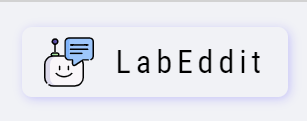

# Hellou ! ! !   Seja bem vindo(a) ao repo do <strong>LabEddit</strong>

<em>Esté projeto foi desenvolvido utilizando a biblioteca React</em>
 

Deploy in [surge](http://jose-isaac-labeddit.surge.sh/)

### Possui como depedência as seguintes libs:

<ul>
  <li>styled-components</li>
  <li>axios</li>
  <li>react-router-dom</li>
</ul>

### Requisitos

<input type="checkbox" checked disabled> Página de login

<ul>
    <li>Ao entrar na nossa aplicação, se o usuário ainda não estiver logado ele deve ser direcionado para tela de login.</li>
    <li>Devem ser mostrado:</li>
    <ul>
        <li>campo para o email</li>
        <li>campo paro a senha</li>
        <li>um botão para a página de signup</li>
    </ul>
</ul>

<input type="checkbox" checked disabled> Página de cadastro

<ul>
    <li>Essa página é destinada a criação de  um novo usuário.</li>
   <li>Devem ser mostrado:</li>
    <ul>
        <li>campo para o nome do usuário</li>
        <li>campo para o email</li>
        <li>campo paro a senha</li>
        <li>um botão para a página de login</li>
    </ul>
</ul>

<input type="checkbox" checked disabled> Página de Feed

<ul>
    <li>Página inicial da aplicação, caso o usuário já esteja logado, ela só pode ser acesado por usuário autenticados no app. Ela é responsavel por obter e listar todos os post publicados.</li>
    <li>Cada post possui as seguintes informações:</li>
    <ul>
      <li>Nome do usuário</li>
      <li>Título do post</li>
      <li>Texto do post</li>
      <li>Data de criação</li>
      <li>A direção da interação do usuário com o post ( Se curtiu, se não curtiu ou se não achou legal) que vem na forma de 1, 0 ,-1 respectivamente.</li>
      <li>Quantidade de comentários</li>
      <li>Quantidade de interações</li>
      <li>Ao clicar sobre o post deve ser direcionado para página de detalhes do respectivo post.</li>
    </ul>
    <li>Além disso ela possui um formulário para a criação de um noco post, ele recebe as seguintes informações:</li>
    <ul>
      <li>Título do post</li>
      <li>Conteúdo do post</li>
    </ul>
</ul>

<input type="checkbox" checked disabled> Página de detalhes do post

<ul>
  <li>Página de detalhes de um post, caso o usuário já esteja logado, ela só pode ser acesado por usuário autenticados no app. Ela é responsavel por obter e listar todos os comentários relacionados aquele post.</li>
  <li>Ela possui um Card do post como as mesmas informações da páginado feed.</li>
  <li>Abaixo do card deve ter um formulário para a criação de um novo comentários ele revece o conteúdo do novo comentário.</li>
  <li>Cada comentário possui as seguintes informações:</li>
    <ul>
      <li>Nome do usuário</li>
      <li>Texto do comentário</li>
      <li>Data de criação</li>
      <li>A direção da interação do usuário com o comentário ( Se curtiu, se não curtiu ou se não achou legal) que vem na forma de 1, 0 ,-1 respectivamente.</li>
      <li>Quantidade de interações</li>
    </ul>
</ul>

### Mockups da aplicação

### Rodando localmente

Para executar esse projeto em sua máquila local é necessário que o node js esteja intalado. Caso ainda não tenha, você pode está fazendo o download [aqui](https://nodejs.org/en/download/).

<h4>1º | Faça o clone do repo:</h4>

<code>
    git clone https://github.com/future4code/Jose-Isaac-Campos.git
</code>

 
 

<h4>2º | Navegue até a pasta do projeto:</h4>

<code>
    cd ./Jose-Isaac-Campos/semana12/labeddit
</code>

 
 

<h4>3º | Instale as dependências:</h4>

<code>
   npm install
</code>

 
 

<h4>4º | Inicie o servidor:</h4>

<code>
   npm run start
</code>
